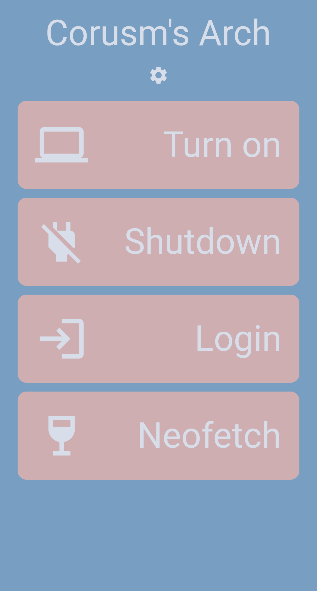

# corusm's dotfiles  

These are the configs of my main arch linux desktop.

# contents
1. [basic software](#basic-software)
2. [themes](#themes)
3. [gaming](#gaming)
4. [work](#work)
5. [mobile](#mobile)
6. [images](#images)

# basic software
This is the software I use in this setup.

|Category|Name|
|-------|----|
|wm|bspwm (rounded corners fork)|
|terminal|urxvt|
|shell|zsh|
|bar|polybar|
|launcher|rofi|
|compositor|picom|
|file browser|ranger|
|browser|firefox|
|spotify customization|spicetify|
|lock|gllock|

# themes
This color scheme is inspired by the [Sør-Helgeland](https://www.behance.net/gallery/24075785/Soer-Helgeland) collage. This is where the background is from.

# gaming 
For gaming I use the game launcher [lutris](https://lutris.net/) with a [custom proton version](https://github.com/GloriousEggroll/proton-ge-custom) by GloriousEggroll. In addition to that I use [MangoHUD](https://github.com/flightlessmango/MangoHud) for monitoring my FPS and system utilization.

# work
For work I use the following Software.
|Category|Name|
|-------|----|
|Office Apps|Libre Office|
|University Hub|Notion|
|Scientific Papers|Overleaf [(self hostet)](https://corusm.de/blog/sharelatex.html)|
|Calendar|Minetime|
|E-Mail|Mailspring|

# mobile
My mobile phone ([Fairphone 3+](https://www.fairphone.com)) setup is also inspired by [Sør-Helgeland](https://www.behance.net/gallery/24075785/Soer-Helgeland), here some insights.

In addition to that I made a little flutter app for controlling my desktop from my phone.

  

# images

